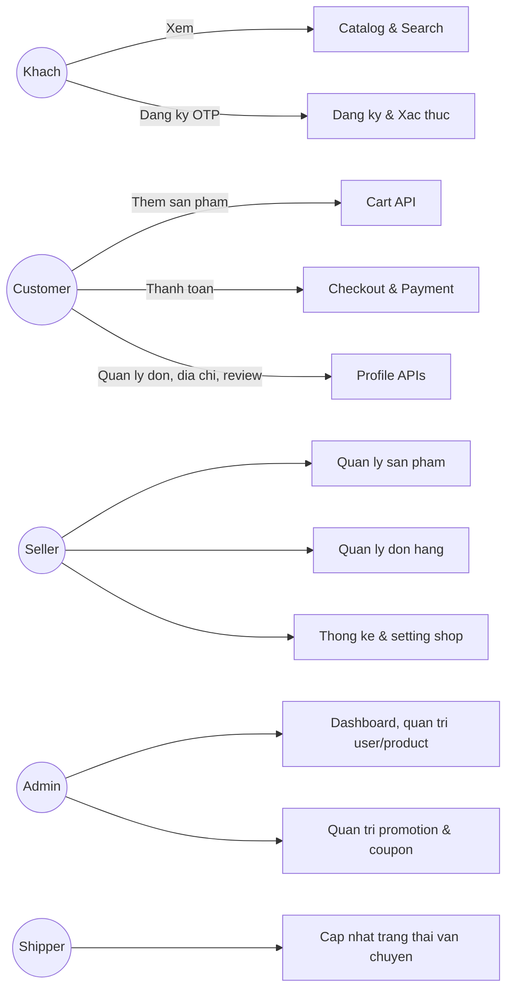
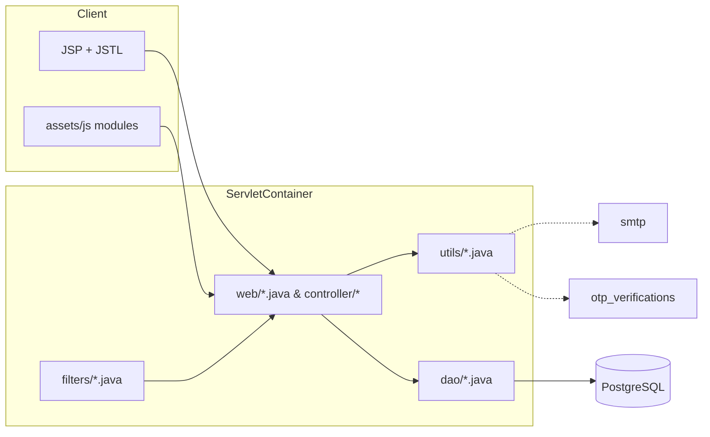
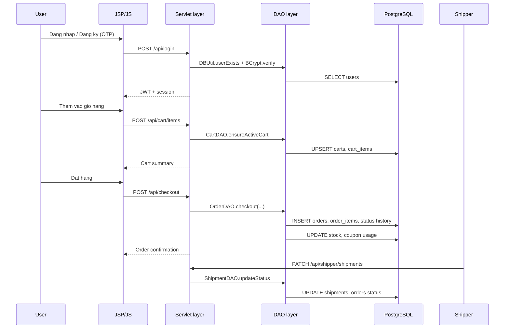
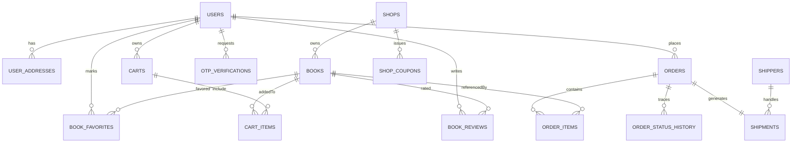

# JVA Bookstore

## Gioi thieu nhanh
- Nen tang thuong mai dien tu da vai tro (khach, customer, seller, admin, shipper) duoc xay dung bang Java Servlet + JSP va PostgreSQL.
- Tang backend su dung JWT + BCrypt, OTP email, gio hang persistent va cac goi DAO phuc vu nghiep vu don hang, shipment, coupon.
- Frontend duoc to chuc bang JSP, Sitemesh decorator va JavaScript phan he (assets/js) cho admin, seller, checkout, cart.
- Tai lieu nay duoc viet lai de mo ta cach build, cach phat trien tung chuc nang, phan tich code-base, database va luong workflow kem cac so do minh hoa.

## Cong nghe su dung
- **Backend**: Java 11, Servlet 4.0, JSP/JSTL, Sitemesh 2.
- **Build & Runtime**: Maven, Tomcat (thong qua `maven-war-plugin` va `webapp-runner`), Procfile cho Heroku.
- **Database**: PostgreSQL (JSONB, INDEX), JDBC, cac script migration (`schema.sql`, `otp_schema.sql`, `create_shops_table.sql`, cac file *.sql bo sung).
- **Bao mat**: JWT (`utils/JwtUtil.java`), BCrypt (`org.mindrot:jbcrypt`), servlet filter (`filters/JwtFilter.java`, `filters/EncodingFilter.java`).
- **Tien ich**: Gson, Jackson, JavaMail, OpenCSV, ShippingCalculator custom, FileStorage cho media review.

## Cau truc thu muc
```text
.
|- pom.xml
|- src/main/java
|  |- controller/ (Servlet cho cac trang JSP cong khai va admin)
|  |- dao/        (Lop truy cap du lieu: BookDAO, OrderDAO, ShipmentDAO, ...)
|  |- filters/    (EncodingFilter, JwtFilter)
|  |- models/     (POJO: Book, Order, Shipment, Shop, UserAddress, ...)
|  |- utils/      (DBUtil, JwtUtil, EmailUtil, OTPUtil, ShippingCalculator, ...)
|  \- web/        (Servlet REST/API cho admin, seller, profile, cart, checkout)
|- src/main/resources
|  |- db.properties, email.properties
|  |- schema.sql, otp_schema.sql, migration_add_shop_info.sql
|  \- cac script SQL ho tro migration
|- src/main/webapp
|  |- assets/css, js, img
|  |- admin/*.jsp, Seller/*.jsp, *.jsp cong khai (index, catalog, checkout, profile, ...)
|  \- WEB-INF/{decorators,includes}/ (layout Sitemesh, header/footer)
|- docs/ (de trong, co the dung luu so do tuong lai)
|- *.sql (script patch: apply_migration.sql, 20251027_*.sql, ...)
|- app.json, Procfile, system.properties (trien khai Heroku)
|- CreateTestUser.java, GenerateHash.java, TestDB.java (tien ich CLI)
\- books_full_9xx.csv (du lieu mau, 4.6MB)
```

## Cai dat moi truong
- **PostgreSQL**: tao database theo `db.properties` hoac dat bien moi truong `DATABASE_URL`. Tat ca script SQL nam trong `src/main/resources` va thu muc goc.
- **Bien moi truong quan trong**:
  - `JWT_SECRET` (neu khong set se fallback chuoi mac dinh trong `utils/JwtUtil.java`).
  - `DATABASE_URL` (uu tien so voi `db.properties`).
  - SMTP: `SMTP_HOST`, `SMTP_PORT`, `SMTP_USER`, `SMTP_PASS`, `SMTP_FROM` hoac `email.properties`.
  - `BOOKSTORE_UPLOAD_DIR` de thay doi thu muc luu media review (FileStorageUtil).
  - `EMAIL_DISABLED`, `EMAIL_DEBUG` de dieu khien gui mail dev.
- **Charset**: `filters/EncodingFilter` buoc UTF-8; DBUtil se `SET client_encoding TO 'UTF8'` cho ket noi.

## Build va chay thu
1. Cai dat Java 11 va Maven, PostgreSQL.
2. Khoi tao schema:
   - Chay `src/main/resources/schema.sql` + `otp_schema.sql`.
   - Chay `create_shops_table.sql`, `migration_add_shop_info.sql` va cac script trong goc (20251027_*). Sap xep theo thu tu ngay phat hanh.
   - (Tuy chon) `example.sql` de seed category, shop, shipper, coupon, book mau.
3. Cap nhat `src/main/resources/db.properties` neu su dung JDBC local.
4. Build WAR:
   ```bash
   mvn clean package
   ```
   Ket qua: `target/ROOT.war` va `target/dependency/webapp-runner.jar`.
5. Chay nhanh bang webapp-runner:
   ```bash
   java -jar target/dependency/webapp-runner.jar --port 8080 target/ROOT.war
   ```
   hoac `mvn tomcat8:run`.
6. Trien khai Heroku/Render: su dung `Procfile` (`web: java $JAVA_OPTS -jar target/dependency/webapp-runner.jar --port $PORT target/ROOT.war`) va `app.json`.

## Du lieu khoi tao
- `utils/BookDataLoader` tu dong seed `books_full_5xx.csv` neu bang `books` rong (doc tu classpath hoac file he thong).
- File CSV thuc te `books_full_9xx.csv` co the dung de nhap them (chinh `BookDataLoader` neu muon).
- `CreateTestUser.java` tao user mau (hash bang BCrypt); `GenerateHash.java` ho tro sinh password hash.
- Cac script `20251027_add_payment_metadata.sql`, `20251027_fix_shop_settings.sql`, `add_shop_id_to_orders.sql`, `update_books_shop.sql` bo sung truong order/payment/shop gan day.

## Luoc do chuc nang


## Kien truc he thong


## Workflow chinh


## Phan tich source code

### Lop Servlet & Filter (backend API/JSP bridge)
| Module | URL chinh | File | Ghi chu |
| --- | --- | --- | --- |
| Auth | `/api/login`, `/api/auth/*` | `src/main/java/web/AuthServlet.java` | Dang ky OTP, dang nhap BCrypt, reset password, sinh JWT, set session seller/shop. |
| Catalog | `/api/books`, `/books/detail` | `src/main/java/web/BooksApiServlet.java`, `web/BookDetailServlet.java` | Loc, tim kiem, de xuat, thong tin chi tiet, highlight review. |
| Cart | `/api/cart`, `/api/cart/items/*` | `src/main/java/web/CartServlet.java`, `dao/CartDAO.java` | Gio hang persistent theo session + user, merge khi login, tinh toan tong tien. |
| Checkout | `/api/checkout`, `/checkout` | `src/main/java/web/CheckoutServlet.java`, `dao/OrderDAO.java` | Tiep nhan dia chi, coupon, shipping quote, tao order + order_items + payment metadata. |
| Profile | `/api/profile/*` | `src/main/java/web/ProfileServlet.java` | Quan ly thong tin ca nhan, dia chi, don hang, coupon, yeu thich, review lich su. |
| Reviews & Comments | `/api/reviews`, `/api/comments` | `src/main/java/web/ReviewServlet.java`, `web/CommentServlet.java` | CRUD review + media (FileStorageUtil), binh luan lien ket order. |
| Shipper APIs | `/api/shipper/*` | `src/main/java/web/ShipperApiServlet.java`, `web/ShippingQuoteServlet.java` | Phan cong shipper, cap nhat trang thai, tinh phi van chuyen dong. |
| Admin REST | `/api/admin/*` | `src/main/java/web/admin/*.java`, `controller/admin/*.java` | Quan tri user, san pham, promotion, commission, analytics, shipper. |
| Seller REST | `/api/seller/*` | `src/main/java/web/seller/*.java` | Quan ly shop, san pham (CRUD, upload), don hang, thong ke, coupon shop. |
| Filter | `/api/*` | `src/main/java/filters/JwtFilter.java`, `filters/EncodingFilter.java` | Kiem tra JWT/session, cho phep endpoint cong khai, thiet lap UTF-8. |

### DAO & Model layer
- `dao/BookDAO.java`: truy xuat book, filter, thong ke review, update stock.
- `dao/CartDAO.java`: quan ly bang `carts`, `cart_items`, xu ly merge session/user, lock optimistic.
- `dao/OrderDAO.java`: tao order, quan ly status, payment metadata JSONB, shipping snapshot, apply coupon, record history.
- `dao/ShipmentDAO.java`: tim, gan, cap nhat shipment, dong bo status don hang (ket hop shipper_user_id).
- `dao/ShopDAO.java`, `ShopCouponDAO.java`, `CouponDAO.java`: thong tin shop, coupon chung/shop, su dung/het han.
- `dao/UserAddressDAO.java`: CRUD dia chi, dat default, mapping JSON shipping snapshot.
- `dao/ReviewDAO.java`, `CommentDAO.java`, `FavoriteDAO.java`, `RecentViewDAO.java`: tuong tac nguoi dung voi san pham.
- `models/*.java`: POJO giai ma ket qua: `Order`, `OrderItem`, `Shipment`, `ShippingQuote` (enum MatchLevel), `Cart`, `CartItem`, `Shop`, `ShopCoupon`, `UserAddress` va cac entity lien quan khac.

### Utils & ho tro
- `utils/DBUtil.java`: quan ly ket noi, doc `DATABASE_URL`/`db.properties`, tao bang co ban (users, carts, cart_items, coupons, shippers, store_discounts, orders, order_items, ...) va cung cap helper user/password/reset token.
- `utils/JwtUtil.java` + `utils/AuthUtil.java`: phat hanh/kiem tra JWT, rut email/ID tu token hoac session.
- `utils/OTPUtil.java`: luu OTP vao bang `otp_verifications` voi cooldown, attempt limit.
- `utils/EmailUtil.java`: doc SMTP config, fallback log console neu disable.
- `utils/ShippingCalculator.java`: map dia chi -> shipper, tinh match theo district/city/province/region, chon phi tot nhat.
- `utils/FileStorageUtil.java`: validate MIME, gioi han kich thuoc, luu file upload review vao thu muc cau hinh.
- `CreateTestUser.java`, `GenerateHash.java`, `TestDB.java`, `run_*` scripts: tien ich CLI/test migration.

### Giao dien JSP & assets
- `src/main/webapp/index.jsp`, `catalog.jsp`, `book-detail.jsp`, `checkout.jsp`, `profile.jsp` duoc bao boi Sitemesh (`WEB-INF/decorators/main.jsp`) va include header/footer.
- Admin JSP (`src/main/webapp/admin/*.jsp`) + JS module `assets/js/admin/*` render chart, datatable, form dynamic.
- Seller JSP (`src/main/webapp/Seller/*.jsp`) + `assets/js/seller/*` quan ly san pham, don, analytics.
- JS chia nho: `app-shell.js` (layout, auth token), `cart-client.js`, `checkout-page.js`, `global-search.js`.

## Phan tich database

### Bang chinh
| Bang | Muc dich | Truong dang chu y |
| --- | --- | --- |
| `users` | Tai khoan, role (`admin`, `seller`, `customer`, `shipper`), status | `password_hash`, `email_verified`, `reset_token`, `status`. |
| `otp_verifications` | Luu OTP dang ky/reset | `expires_at`, `attempts`, `verified`. |
| `books` | Thong tin sach | `shop_id`, `shop_name`, `rating_avg`, `stock_quantity`, `highlights`, `specifications` (JSON text). |
| `carts` + `cart_items` | Gio hang persistent | `session_id`, `status`, `merge_at`, `unit_price_snapshot`. |
| `orders` + `order_items` | Don hang | `shipping_snapshot` JSONB, `cart_snapshot`, `payment_metadata`, `coupon_snapshot`, `status` enum. |
| `order_status_history` (tao trong DBUtil) | Lich su trang thai order | `actor`, `note`. |
| `shipments` + `shipment_events` | Theo doi van chuyen | `shipper_user_id`, `cod_collected`, `status`, `events` log. |
| `user_addresses` | Dia chi giao hang | `is_default`, `province`, `city`, `ward`. |
| `coupons`, `shop_coupons`, `coupon_usages` | Khuyen mai, dieu kien | `type`, `discount_value`, `usage_limit`, `apply_to`. |
| `book_reviews`, `review_media`, `book_favorites`, `recent_views`, `comments` | Tuong tac nguoi dung | Rang buoc UNIQUE, check do dai noi dung. |
| `shops`, `shop_settings`, `shop_staff` | Quan ly shop | `commission_rate`, `theme_color`, `status`. |
| `shippers` | Doi tac giao hang | `service_area`, `base_fee`, `estimated_time`. |

### ER co ban


## Huong dan phat trien tung chuc nang
- **Xac thuc & dang ky**:
  1. Cap nhat `AuthServlet` de xu ly business moi (VD multi-factor) va `JwtFilter` neu mo rong danh sach endpoint public.
  2. Bo sung truong DB trong `users`/`otp_verifications` (cap nhat schema + migration).
  3. Cap nhat giao dien `login.jsp`, `register.jsp`, assets JS lien quan.
- **Catalog & tim kiem**:
  1. Mo rong `BooksApiServlet` (loc, sort), `BookDAO` (query).
  2. Cap nhat view `catalog.jsp` va script `catalog-page.js`.
  3. Neu them truong sach -> cap nhat `models/Book.java`, `schema.sql`, migration.
- **Cart / Checkout**:
  1. `CartDAO` + `CartServlet` (state machine, voucher).
  2. `CheckoutServlet` + `OrderDAO` (payment, shipping, coupon).
  3. View `cart-ui.js`, `checkout.jsp`, `checkout-page.js`.
  4. Neu them payment provider -> luu metadata JSONB + webhook Servlet moi.
- **Profile & dich vu hau ban**:
  1. Mieng ghep `ProfileServlet` (orders, dia chi, coupon).
  2. DAO tuong ung (`UserAddressDAO`, `FavoriteDAO`, `RecentViewDAO`, `OrderDAO`).
  3. View `profile.jsp` + JS (dang dong goi lon, can kiem tra phan region).
- **Admin**:
  1. Servlet trong `src/main/java/web/admin`, `controller/admin` phu trach JSP.
  2. Table & chart su dung assets JS (AdDashboard.js, AdProduct.js, ...).
  3. Cap nhat migration neu them truong (categories, promotions, commission).
- **Seller**:
  1. `web/seller/*.java` + JSP `Seller/*.jsp`, script `assets/js/seller`.
  2. Kiem tra session seller (`SellerPageHelper`, `ShopDAO`).
  3. Cap nhat `shop_settings`, `shop_coupons` scripts neu mo rong.
- **Shipper**:
  1. `ShipperApiServlet`, `ShipmentDAO`, `ShippingCalculator`.
  2. Cap nhat bang `shipments`, `shipment_events` neu thay doi pipeline.
  3. Giao dien `dashboard-shipper.jsp`.

## Quy trinh van hanh & quan tri
- **Job cap nhat**: `OrderDAO` co status transition map (`ALLOWED_STATUSES`, `STATUS_TRANSITIONS`), ket hop seller/admin/shipper update. Dam bao app su dung cung map khi them trang thai moi.
- **Bao tri DB**: su dung cac file `.sql` theo thu tu thoi gian; script `run_migration_heroku.bat`, `run_add_shop_id_migration.bat` ho tro tren Windows.
- **Monitoring**: `HealthServlet` (`/api/health`) tra JSON, co the dung cho uptime-check.
- **Email/OTP**: `EmailUtil` cho phep disable, OTP co cooldown (2 phut) + max attempt 5 (`OTPUtil`).
- **Upload**: media review duoc kiem tra MIME va kich thuoc (5MB anh, 20MB video); thay doi thu muc qua bien moi truong.

## Script ho tro & tai lieu
- `docs/`: dang trong, co the luu file draw.io / plantuml.
- `CreateTestUser.java`: chay `mvn exec:java -Dexec.mainClass=CreateTestUser` sau khi config DB.
- `GenerateHash.java`: ho tro tao hash offline.
- `TestDB.java`, `TestDBServlet` (0-byte) cho phep thu ket noi.
- `run_add_shop_id_migration.bat`, `apply_migration.sql`, `update_books_shop.sql`: su dung khi bo sung truong `shop_id`.

## Kiem thu & dam bao chat luong
- **Manual checklist**:
  - Dang ky/OTP/Dang nhap cho role customer.
  - Them sach vao gio, merge gio sau khi login.
  - Checkout COD + giam gia coupon, kiem tra order snapshot.
  - Seller tao/duyet san pham, thay doi stock, kiem tra admin Approve (status `books.status`).
  - Shipper cap nhat trang thai, kiem tra `order_status_history`.
  - Admin quan ly user, shipper, promotion.

.
